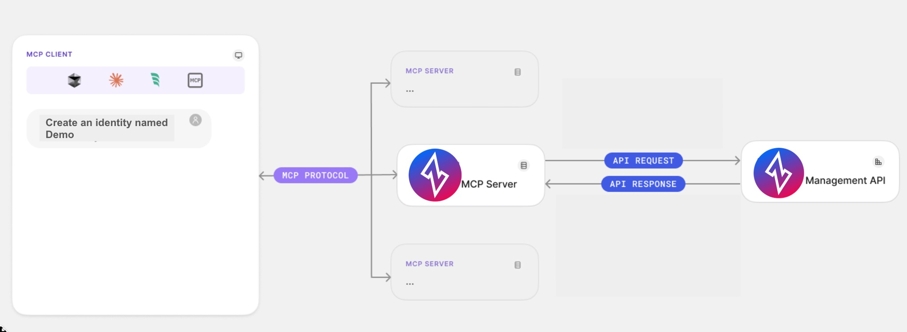

<p align="center">
  
</p>
<div align="center">

[](https://opensource.org/licenses/Apache-2.0)
[](https://go.dev/)

</div>

<div align="center">

🚀 [Getting Started](#-getting-started) • 🕸️ [Architecture](#%EF%B8%8F-architecture) • 🔐 [Authentication](#-authentication) • 🛠️ [Supported Tools](#%EF%B8%8F-supported-mcp-tools) • 🔒 [Security](#-security) • 🩺 [Troubleshooting](#-troubleshooting) • 📋 [Debug Logs](#-debug-logs) • 👨‍💻 [Development](#-development)

</div>

The Ziti MCP Server is sponsored by [NetFoundry](https://netfoundry.io) as part of its portfolio of solutions
for secure workloads and agentic computing.
NetFoundry is the creator of [OpenZiti](https://netfoundry.io/docs/openziti/)
and [zrok](https://netfoundry.io/docs/zrok/getting-started).

[MCP (Model Context Protocol)](https://modelcontextprotocol.io/introduction) is an open protocol introduced by Anthropic that standardizes how large language models communicate with external tools, resources or remote services.

The Ziti MCP Server integrates with LLMs and AI agents, allowing you to perform various Ziti network management operations using natural language. For instance, you could simply ask Claude Desktop to perform Ziti management operations:

- > List which identities exist
- > Tell me if there are any exposures in the network
- > Do you see potential misconfigurations?
- > Which identities have access to the Demo1 service?
- > Create a new Ziti identity named "Demo" and get its ID
- > Log into my prod Ziti network using UPDB
- > Switch to the staging network
- > etc.

<br/>

## 🚀 Getting Started

**Prerequisites:**

- [Claude Desktop](https://claude.ai/download) or any other [MCP Client](https://modelcontextprotocol.io/clients)
- [OpenZiti](https://openziti.io/) network
- [Go 1.24+](https://go.dev/dl/) (only if building from source)

<br/>

### Install

#### Download a pre-built binary

Pre-built binaries are available for macOS, Linux, and Windows (amd64 and arm64) on the [releases page](https://github.com/openziti/ziti-mcp-server-go/releases).

**macOS (Apple Silicon)**

```bash
curl -sL https://github.com/openziti/ziti-mcp-server-go/releases/latest/download/ziti-mcp-server_darwin_arm64.tar.gz | tar xz
sudo mv ziti-mcp-server /usr/local/bin/
```

**macOS (Intel)**

```bash
curl -sL https://github.com/openziti/ziti-mcp-server-go/releases/latest/download/ziti-mcp-server_darwin_amd64.tar.gz | tar xz
sudo mv ziti-mcp-server /usr/local/bin/
```

**Linux (amd64)**

```bash
curl -sL https://github.com/openziti/ziti-mcp-server-go/releases/latest/download/ziti-mcp-server_linux_amd64.tar.gz | tar xz
sudo mv ziti-mcp-server /usr/local/bin/
```

**Linux (arm64)**

```bash
curl -sL https://github.com/openziti/ziti-mcp-server-go/releases/latest/download/ziti-mcp-server_linux_arm64.tar.gz | tar xz
sudo mv ziti-mcp-server /usr/local/bin/
```

**Windows**

Download the appropriate `.zip` from the [releases page](https://github.com/openziti/ziti-mcp-server-go/releases) and add the extracted `ziti-mcp-server.exe` to your PATH.

#### Build from source

```bash
go install github.com/openziti/ziti-mcp-server-go/cmd/ziti-mcp-server@latest
```

### Register with your AI Client

Use `install` to register the Ziti MCP Server with your AI client. This only updates the client's configuration file — it does **not** authenticate. Use the runtime login tools or `init` for that.

```bash
# Register with Claude Desktop (default)
ziti-mcp-server install

# Register with a specific client
ziti-mcp-server install --client claude-code
ziti-mcp-server install --client cursor
ziti-mcp-server install --client windsurf
ziti-mcp-server install --client vscode
ziti-mcp-server install --client warp

# Register with read-only tools only
ziti-mcp-server install --read-only

# Register with specific tool patterns
ziti-mcp-server install --tools '*Identit*,list*'
```

After installing, restart your AI client and use the runtime login tools to authenticate (e.g., ask: _"Log into my Ziti network at ctrl.example.com with username admin"_).

### Start and Log In

The server can start with **no prior configuration**. The AI agent can log into networks at runtime using the built-in login tools:

```bash
ziti-mcp-server run
```

Then in your AI client, simply ask:

> Log into my Ziti network at 192.168.1.100:1280 with username admin and password admin

For non-interactive or automated setups, use `init` to pre-configure credentials before starting:

```bash
ziti-mcp-server init \
  --auth-mode updb \
  --ziti-controller-host <your-controller-host> \
  --username <username> \
  --password <password> \
  --profile prod
```

See [Authentication](#-authentication) for all supported modes (UPDB, device auth, client credentials, identity file).

### Manual Client Configuration

The `install` command handles client configuration automatically. If you need to configure an MCP client manually, add this to its configuration and restart:

```json
{
  "mcpServers": {
    "ziti": {
      "command": "/path/to/ziti-mcp-server",
      "args": ["run"],
      "capabilities": ["tools"],
      "env": {
        "OPENZITI_MCP_DEBUG": "true"
      }
    }
  }
}
```

You can add `--tools '<pattern>'` and/or `--read-only` to the args array to control which tools are available. See [Restricting Tool Access](#restricting-tool-access).

### Verify your integration

Restart your MCP Client (Claude Desktop, Windsurf, Cursor, Warp, etc.) and ask it to help you manage your Ziti network.

## 🕸️ Architecture

The Ziti MCP Server implements the Model Context Protocol, allowing clients (like Claude) to:

1. Request a list of available Ziti tools
2. Call specific tools with parameters
3. Receive structured responses from the Ziti Management API

The server handles authentication, request validation, and secure communication with the Ziti Management API.

<div align="center">
  
</div>

> [!NOTE]
> The server operates as a local process that connects to Claude Desktop, enabling secure communication without exposing your Ziti credentials.

## 🔐 Authentication

The Ziti MCP Server uses the Ziti Management API and requires authentication to access your Ziti network.

### Authentication Modes

The server supports four authentication modes:

#### UPDB Mode (Username/Password)

Use this mode for direct username/password authentication against the Ziti controller:

```bash
ziti-mcp-server init \
  --auth-mode updb \
  --ziti-controller-host <your-controller-host> \
  --username <username> \
  --password <password>
```

Or at runtime via the AI agent using the `loginUpdb` tool.

#### Device Auth Mode (Interactive Login)

Use this mode for interactive browser-based login. Recommended for development and user-facing scenarios:

```bash
ziti-mcp-server init \
  --auth-mode device-auth \
  --ziti-controller-host <your-controller-host> \
  --idp-domain <your-idp-domain> \
  --idp-client-id <your-client-id> \
  --idp-audience <your-audience>
```

Or at runtime via the `loginDeviceAuth` tool (returns a verification URL for the user, then `completeLogin` to finish).

#### Client Credentials Mode (Service Account)

Use this mode for service accounts and automation. Recommended for production environments:

> [!NOTE]
> Keep the token lifetime as minimal as possible to reduce security risks. [See more](https://auth0.com/docs/secure/tokens/access-tokens/update-access-token-lifetime)

```bash
ziti-mcp-server init \
  --auth-mode client-credentials \
  --ziti-controller-host <your-controller-host> \
  --idp-domain <your-idp-domain> \
  --idp-client-id <your-client-id> \
  --idp-client-secret <your-client-secret>
```

#### Identity File Mode (mTLS Certificate)

Use this mode for certificate-based authentication with a Ziti identity JSON file. No IdP configuration is needed:

```bash
ziti-mcp-server init \
  --auth-mode identity \
  --identity-file <path-to-identity.json>
```

The identity file is a standard Ziti identity JSON file containing `ztAPI`, `id.cert`, `id.key`, and `id.ca` fields. The certificate material is extracted and stored in the config file. The identity file may be deleted after a successful `init` (for additional security, if desired).

> [!IMPORTANT]
>
> When using CLI `init`, it needs to be run whenever:
>
> - You're setting up the MCP Server for the first time
> - You've logged out from a previous session
> - You want to switch to a different Ziti network
> - Your token has expired
>
> Alternatively, use the runtime login tools (`loginUpdb`, etc.) to authenticate without restarting the server.

### Multi-Profile Support

The server supports multiple named network profiles, allowing you to manage several Ziti networks simultaneously:

```bash
# Pre-configure two profiles
ziti-mcp-server init --auth-mode updb --profile prod ...
ziti-mcp-server init --auth-mode updb --profile staging ...

# Start with a specific profile active
ziti-mcp-server run --profile prod
```

At runtime, the AI agent can:
- **Log into additional networks** using `loginUpdb`, `loginIdentity`, etc.
- **List all networks** using `listNetworks`
- **Switch between networks** using `selectNetwork`
- **Log out** from a network using `logout`

Credentials are stored in `~/.config/ziti-mcp-server/config.json` with 0600 permissions.

### Session Management

To see information about your current authentication session:

```bash
ziti-mcp-server session
ziti-mcp-server session --profile prod
```

### Logging Out

```bash
ziti-mcp-server logout
ziti-mcp-server logout --profile prod
```

Or at runtime via the AI agent using the `logout` tool.

## 🛠️ Supported MCP Tools

The Ziti MCP Server provides **201 Ziti API tools** plus **8 meta-tools** for managing your Ziti network through natural language. Tools are organized by resource type.

> **Tip:** Use `--read-only` or `--tools` patterns to expose only the tools you need. See [Restricting Tool Access](#restricting-tool-access).

### Meta-Tools (Network Management)

These tools are always available regardless of `--tools` or `--read-only` filtering.

| Tool                     | Description                                                                                      |
| ------------------------ | ------------------------------------------------------------------------------------------------ |
| `loginUpdb`              | Connect using username/password authentication                                                   |
| `loginIdentity`          | Connect using a Ziti identity JSON (mTLS certificate)                                            |
| `loginClientCredentials` | Connect using OAuth2 client credentials                                                          |
| `loginDeviceAuth`        | Start OAuth2 device auth flow (returns verification URL)                                         |
| `completeLogin`          | Complete a pending device-auth login after browser approval                                      |
| `logout`                 | Disconnect from a Ziti network (clear profile credentials)                                       |
| `listNetworks`           | List all configured network profiles with connection status                                      |
| `selectNetwork`          | Switch the active network profile                                                                |

### Tool Categories

| Category                      | Tools | Description                                               |
| ----------------------------- | ----: | --------------------------------------------------------- |
| Identities                    |    22 | CRUD, relationships, lifecycle, posture, tracing          |
| Services                      |    12 | CRUD and relationship queries                             |
| Edge Routers                  |    11 | CRUD, relationships, re-enrollment                        |
| Edge Router Policies          |     7 | CRUD and relationship queries                             |
| Service Edge Router Policies  |     7 | CRUD and relationship queries                             |
| Service Policies              |     8 | CRUD and relationships (Dial/Bind)                        |
| Configs                       |     6 | CRUD and service relationships                            |
| Config Types                  |     6 | CRUD and config queries                                   |
| Auth Policies                 |     5 | CRUD (primary/secondary auth settings)                    |
| Authenticators                |     5 | CRUD (updb/cert)                                          |
| Certificate Authorities       |     7 | CRUD, JWT retrieval, verification                         |
| External JWT Signers          |     5 | CRUD for external JWT signers                             |
| Posture Checks                |     8 | CRUD, types, and role attributes                          |
| Routers                       |     5 | CRUD for fabric routers                                   |
| Transit Routers               |     5 | CRUD for transit routers                                  |
| Terminators                   |     5 | CRUD for terminators                                      |
| Enrollments                   |     5 | CRUD and refresh                                          |
| Controller Settings           |     6 | CRUD and effective value queries                          |
| Controllers & System Info     |     4 | Version, capabilities, summary                            |
| Sessions & API Sessions       |     6 | List, detail, delete                                      |
| Identity Types                |     2 | List and detail                                           |
| Fabric (Routers, Services, …) |    34 | Fabric-layer CRUD, circuits, links, cluster, DB snapshots |

> See **[docs/tools.md](docs/tools.md)** for the full tool reference with detailed tables and example prompts.

### Example Prompts

- `Show me all Ziti identities`
- `Which identities have access to the Demo1 service?`
- `Create a new identity called 'demo-admin' and make it an admin`
- `List all edge routers and their status`
- `Show me all Dial service policies`
- `What version is the Ziti controller running?`
- `Give me a summary of the network — how many identities, services, and routers exist?`
- `Create a Bind policy for the 'my-api' service`

## 🔒 Security

### Restricting Tool Access

When configuring the Ziti MCP Server, limit tool access based on your specific needs:

```bash
# Enable only read-only operations
ziti-mcp-server run --read-only

# Alternative way to enable only read-only operations
ziti-mcp-server run --tools 'list*,get*'

# Limit to just identity-related tools
ziti-mcp-server run --tools '*Identit*'

# Limit to read-only identity-related tools
ziti-mcp-server run --tools '*Identit*' --read-only

# Run the server with all tools enabled
ziti-mcp-server run --tools '*'
```

> [!IMPORTANT]
> When both `--read-only` and `--tools` flags are used together, the `--read-only` flag takes priority for security. Meta-tools (login, logout, listNetworks, selectNetwork) are always available regardless of filtering.

This approach offers several important benefits:

1. **Enhanced Security**: Limiting available tools reduces the potential attack surface.
2. **Better Performance**: Fewer tools means less context window usage for tool reasoning.
3. **Resource-Based Access Control**: Configure different instances with different tool sets.
4. **Simplified Auditing**: Easier to track which operations were performed.

### Credential Storage

- Credentials are stored in `~/.config/ziti-mcp-server/config.json` with 0600 permissions
- The config file is never world-readable
- Authentication supports OAuth 2.0 device authorization, client credentials, mTLS certificates, and UPDB
- Easy credential removal via `logout` command or tool

> [!IMPORTANT]
> For security best practices, always log out when you're done with a session or switching between networks.

> [!CAUTION]
> Always review the permissions requested during the authentication process to ensure they align with your security requirements.

### Security Scanning

We recommend regularly scanning this server with community tools built to surface protocol-level risks:

- **[mcpscan.ai](https://mcpscan.ai)** — Web-based scanner for MCP endpoints
- **[mcp-scan](https://github.com/invariantlabs-ai/mcp-scan)** — CLI tool for evaluating server behavior

### Reporting Issues

To provide feedback or report a bug, please [raise an issue on our issue tracker](https://github.com/openziti/ziti-mcp-server-go/issues).

## 🩺 Troubleshooting

Start troubleshooting by exploring all available commands and options:

```bash
ziti-mcp-server help
```

### 🚨 Common Issues

1. **Authentication Failures**
   - Ensure you have the correct permissions in your Ziti network
   - Try re-initializing with `ziti-mcp-server init --auth-mode <mode> ...`
   - Or use the runtime login tools to re-authenticate

2. **TLS Certificate Errors**
   - The server auto-fetches the controller's CA on login via the EST `/cacerts` endpoint
   - If the CA fetch fails, add the controller CA to your system trust store
   - Or re-login to trigger a fresh CA fetch

3. **Client Can't Connect to the Server**
   - Restart your MCP client after configuration changes
   - Check that the binary path in the client config is correct

4. **Invalid Configuration Error**
   - This typically happens when no profile is active or credentials are missing
   - Use `listNetworks` to check profile status
   - Use a login tool or `ziti-mcp-server init` to authenticate

> [!TIP]
> Most connection issues can be resolved by restarting both the server and your MCP client.

## 📋 Debug logs

Enable debug mode to view detailed logs:

```sh
export OPENZITI_MCP_DEBUG=true
```

Get detailed MCP Client logs from Claude Desktop:

```sh
# Follow logs in real-time
tail -n 20 -F ~/Library/Logs/Claude/mcp*.log
```

## 👨‍💻 Development

### Building from Source

```bash
# Clone the repository
git clone https://github.com/openziti/ziti-mcp-server-go.git
cd ziti-mcp-server-go

# Build
go build ./cmd/ziti-mcp-server

# Run
./ziti-mcp-server run
```

### Regenerating API Clients

The Ziti API clients in `internal/gen/` are generated from OpenAPI specs using go-swagger:

```bash
make generate
```
